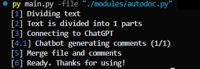

# AutoDoc-ChatGPT

AutoDoc-ChatGPT is a Python script that leverages the power of ChatGPT model to automatically generate documentation for any programming language.

With AutoDoc-ChatGPT, you can easily generate comprehensive documentation for your codebase. Simply provide the path to file you wish to document, and AutoDoc-ChatGPT will generate a detailed description of its functionality, parameters, and return values in natural language.

## Getting Started

### Installing

Clone this repository to your local machine:

```bash
git clone https://github.com/awekrx/AutoDoc-ChatGPT.git
```

Then install the required packages:

```bash
pip install -r requirements.txt
```

## Supported programming languages

- [X]  Python
- [X]  JavaScript
- [X]  TypeScript
- [ ]  Go
- [ ]  C#
- [ ]  C++
- [ ]  PHP
- [ ]  Ruby
- [ ]  Rust
- [ ]  Java
- [ ]  Kotlin

And others...

> `disclaimer`: TypeScript and JavScript has some bugs and is under testing
>
> `disclaimer_2.0`: There is a known error commenting files with 2 or more classes that have methods with the same name.
>

## Usage

### Edit config

Open `config.ini` and add `email` and `password` there if you are not using OAuth authorization.
Otherwise open [ChatGPT](https://chat.openai.com) and get the `__Secure-next-auth.session-token` cookie and write it to the `session-token`.

### Start

```bash
py main.py -file "path to the file"
```

The path to the file can be either relative or absolute.

After execution, the file `yourfilename_commented.language` is created in the folder with the desired file.

OR

```bash
py main.py -file "path to the file"
```

__Not recommended, little tested.__
You can specify a file with a comment option to create such comments.

### Usage example



## Alternative usage

You can also use this as a function in python.

```python
from modules.autodoc import AutoDoc
import configparser

config = configparser.ConfigParser()
config.read("config.ini")

auth = {
    "email": config["ChatGPT"]["email"],
    "password": config["ChatGPT"]["password"],
    "session_token": config["ChatGPT"]["session_token"]
}

result = AutoDoc(
        auth,
        "Code for commenting",
        "language code",
        "example comment model (optional)"
    ).start()
print(result)
# out: Code with comments
```

## Disclaimer

Doesn't always create correct comments. It doesn't always mean what you want. Use as a draft of comments that may need to be edited.

## License

This project is licensed under the MIT License.

## Acknowledgments

Thanks a lot to the development of AI and separately to [СhatGPT](https://chat.openai.com) for generating the Readme.

And also [acheong08](https://github.com/acheong08) for creating [ChatGPT](https://github.com/acheong08/ChatGPT).
